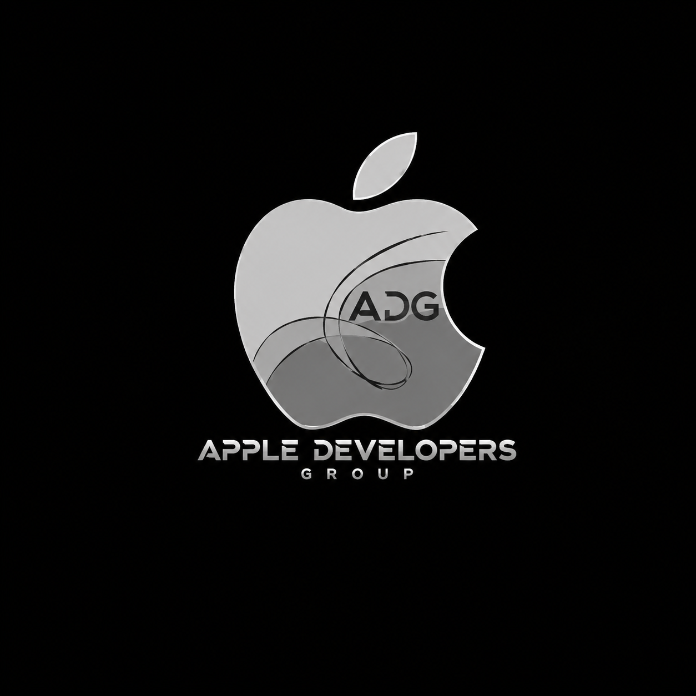

# HLD Workshop
*What Actually Happens When You Tap a Button?*


An interactive, keyboard-driven, non-scrolling slide deck for the MIT Manipal High-Level
System Design workshop. Built with React + TypeScript + Framer Motion + Tailwind CSS v4.

No slides in the PowerPoint sense — every "slide" is a live scene where request packets,
servers, caches, and queues visually animate to explain the concept, not decorate it.
All 13 sections are covered in full during the session — nothing is skipped.

[LabXam](https://labxam.vercel.app) is used live during the workshop as the running
example: every system design concept in this deck (load balancing, caching, CDN,
queues, rate limiting, replicas/sharding, failover, search, observability) is tied
back to how it would apply to LabXam. The workshop also includes a hands-on segment
teaching the audience how to draw architecture diagrams for a system like this one.



## Controls

| Key | Action |
|---|---|
| `→` / `Space` | Advance to the next animation state / scene |
| `←` | Go back one state / scene |
| `Home` | Jump to the very first scene |
| `End` | Jump to the closing scene |
| `S` | Skip to the end of the current section |
| `N` | Toggle the presenter note for the current scene (small, bottom-right, not visible to the audience unless you say so) |
| `F` | Toggle fullscreen |

The top bar shows section progress (13 sections total) and which scene you're on within
the section.

## Project structure

```
src/
  components/
    stage/          the reusable visual vocabulary: Node, Packet, Edge, Prompt,
                     SceneTitle, MiniUser, Stage (the scaled 16:9 canvas)
    scenes/          one file per workshop section (s0-basics.tsx … s12-closing.tsx),
                     each exporting an array of SceneDef (id, title, steps, Component)
    ProgressBar.tsx, Footer.tsx   chrome around the stage
  data/scenes.tsx    assembles all sections into the flat, ordered scene list
  lib/types.ts       shared types + the 1600x900 stage coordinate system
  lib/helpers.ts     small layout helpers (grid positions, staggered delays)
  App.tsx            the state machine: current scene + current animation step,
                     keyboard handling
```

Every scene component receives a single `step: number` prop and switches its rendered
content/animation based on it — that's the "state machine" model: pressing next
sometimes advances the diagram in place, sometimes moves to a new scene entirely.

The **request packet** (the small pill that travels between nodes) is the one
recurring visual motif — it's introduced in Part 1 and reused, relabeled, all the
way through observability in Part 12.

## Sections / scenes

1. **Web Basics** — title, click-a-button, client & server, request/response,
   the database, APIs & static vs. dynamic content
2. **What Is System Design?** — one server/one database is enough, the core
   principle (start simple, add complexity when a real problem demands it),
   transition into the LabXam story
3. **Exam-Night Traffic** — intro, one server floods, vertical scaling, horizontal
   scaling, the load balancer
4. **Caching** — repeated requests, cache miss (full walk-through), cache hit
   (shorter path, contrasted against the miss)
5. **Large Files & CDN** — the app server strains under file downloads, object
   storage, a distant origin is slow, CDN edge caching is fast
6. **Async Work & Queues** — synchronous work blocks the request, the queue,
   workers draining the queue, publish-subscribe (brief)
7. **AI Requests & Rate Limiting** — one user hammers an expensive AI feature,
   rate limiting, and the full picture: queue + worker + cache working together
8. **Growing Beyond Manipal** — latency and distance, regional points of presence
9. **Database Under Strain** — one database strains, read replicas,
   sharding (high-level only)
10. **Something Fails** — health checks, failover ("Server 2 just died — what
    now?"), redundancy & backups
11. **Large-Scale Search** — why a plain query doesn't scale, the search index
12. **Knowing What's Broken** — one request leaves a trace, then logs vs.
    metrics vs. tracing
13. **Closing** — recap of every takeaway, closing message

## Audience pause moments

Scenes that are meant to stop and wait for audience guesses (e.g. "What do you
think breaks first?", "Server 2 just died. What now?") render as a distinct
pill prompt at the bottom of the stage and do **not** auto-reveal the answer —
you control the reveal with the next keypress.